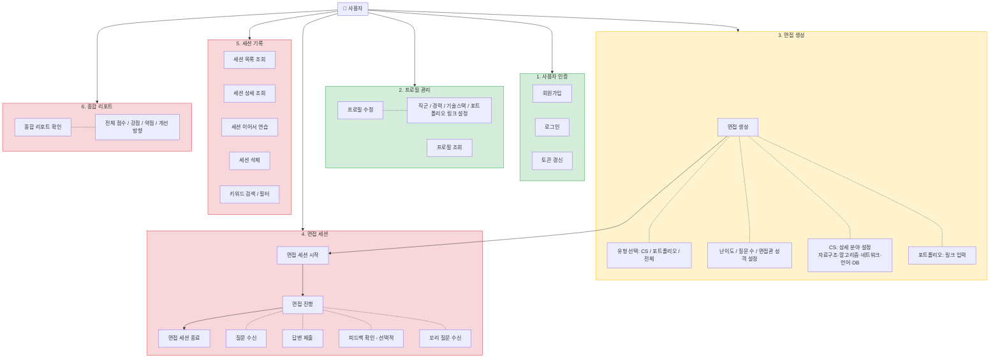

# IntervAI 사용자 유스케이스 다이어그램

```mermaid
graph TB
    subgraph 사용자["👤 사용자"]
        direction TB
    end

    subgraph 인증["1. 사용자 인증"]
        UC1[회원가입]
        UC2[로그인]
        UC3[토큰 갱신]
    end

    subgraph 프로필["2. 프로필 관리"]
        UC4[프로필 수정]
        UC5[프로필 조회]
        UC4 -.- UC4a["직군 / 경력 / 기술스택 / 포트폴리오 링크 설정"]
    end

    subgraph 면접설정["3. 면접 생성"]
        UC6[면접 생성]
        UC6 -.- UC6a["유형 선택: CS / 포트폴리오 / 전체"]
        UC6 -.- UC6b["난이도 / 질문 수 / 면접관 성격 설정"]
        UC6 -.- UC6c["CS: 상세 분야 설정\n자료구조·알고리즘·네트워크·언어·DB"]
        UC6 -.- UC6d["포트폴리오: 링크 입력"]
    end

    subgraph 세션["4. 면접 세션"]
        UC7[면접 세션 시작]
        UC8[면접 진행]
        UC9[면접 세션 종료]
        UC7 --> UC8 --> UC9
        UC8 -.- UC8a["질문 수신"]
        UC8 -.- UC8b["답변 제출"]
        UC8 -.- UC8c["피드백 확인 - 선택적"]
        UC8 -.- UC8d["꼬리 질문 수신"]
    end

    subgraph 기록["5. 세션 기록"]
        UC10[세션 목록 조회]
        UC11[세션 상세 조회]
        UC12[세션 이어서 연습]
        UC13[세션 삭제]
        UC14[키워드 검색 / 필터]
    end

    subgraph 리포트["6. 종합 리포트"]
        UC15[종합 리포트 확인]
        UC15 -.- UC15a["전체 점수 / 강점 / 약점 / 개선 방향"]
    end

    사용자 --> 인증
    사용자 --> 프로필
    사용자 --> 면접설정
    사용자 --> 세션
    사용자 --> 기록
    사용자 --> 리포트

    UC6 --> UC7

    style 인증 fill:#d4edda,stroke:#28a745
    style 프로필 fill:#d4edda,stroke:#28a745
    style 면접설정 fill:#fff3cd,stroke:#ffc107
    style 세션 fill:#f8d7da,stroke:#dc3545
    style 기록 fill:#f8d7da,stroke:#dc3545
    style 리포트 fill:#f8d7da,stroke:#dc3545
```

## 범례
- 🟢 초록: 구현 완료 (인증, 프로필)
- 🟡 노랑: 진행 중 (면접 생성 — Interview, InterviewSession 엔티티 완료)
- 🔴 빨강: 미구현 (면접 진행, 세션 기록, 리포트)
